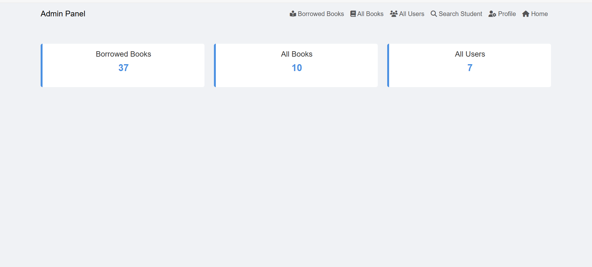
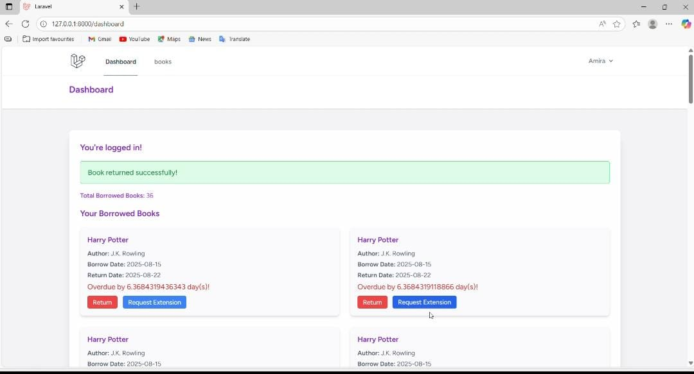

# Online Library Management System
**Information Technology Institute – Summer Training Project**  
**License:** MIT  
**Backend:** Laravel 10  
**Frontend:** Blade Templates, HTML/CSS/JS  

---

## 🎯 Project Overview
The **Online Library Management System** is a web application designed for students and administrators to manage library operations efficiently.  
It provides an **Admin Dashboard** to manage books and users, and a **Student Dashboard** to borrow and return books, track borrow history, and update profiles.

---
## 🌐 Website Preview


## 🗂 Key Features

### 👨‍💼 Admin
- Admin Dashboard: view borrowed books, all books, and all users  
- Add / Update / Delete books  
- Search students by Student ID  
- View student details  
- Update own profile  
- **Authorization**: only admins can perform these tasks  

### 👩‍🎓 Student
- User registration & login  
- Browse all books and view details  
- Borrow and return books  
- Personal dashboard: view borrowed books & return dates  
- Update own profile  

---

## 🛠 Tech Stack

| Component | Technology | Purpose |
|-----------|------------|---------|
| Backend   | Laravel 10 | API, Database, Authentication |
| Frontend  | Blade Templates, HTML/CSS/JS | UI/UX, Interactive Pages |
| Database  | MySQL | Users, Books, Borrowing Records |

---

## 🚀 Setup & Installation

### Backend (Laravel)
```bash
# Clone the repository
git clone https://github.com/amiramahmoud77/Online_Library_Management_System.git
cd lib

# Install dependencies
composer install

# Setup environment
cp .env.example .env
php artisan key:generate
# Update DB credentials in .env

# Run migrations & seeders
php artisan migrate --seed

# Serve the application
php artisan serve
````

### Access

The project can be accessed locally at:

```
http://127.0.0.1:8000
```

---

## 💻 Frontend

All frontend pages are integrated with **Laravel Blade templates**, so **no separate setup** is required.
Static assets (CSS/JS) are located in the `/public` folder.

---

## 📄 API Endpoints

| Method | Endpoint             | Description                         | Access        |
| ------ | -------------------- | ----------------------------------- | ------------- |
| GET    | /books               | List all books                      | Student/Admin |
| GET    | /books/{id}          | Get details of a specific book      | Student/Admin |
| POST   | /books               | Add a new book                      | Admin only    |
| PUT    | /books/{id}          | Update book information             | Admin only    |
| DELETE | /books/{id}          | Delete a book                       | Admin only    |
| POST   | /borrow/{book_id}    | Borrow a book                       | Student only  |
| POST   | /return/{book_id}    | Return a borrowed book              | Student only  |
| GET    | /students            | List all students                   | Admin only    |
| GET    | /students/{id}       | View student details                | Admin only    |
| GET    | /students/{id}/books | Get all books borrowed by a student | Admin/Student |
| GET    | /profile             | Get logged-in user profile          | Admin/Student |
| PUT    | /profile             | Update logged-in user profile       | Admin/Student |
| POST   | /login               | Authenticate user                   | Public        |
| POST   | /register            | Register new student                | Public        |
 ### Admin Dashboard


### Student Dashboard


